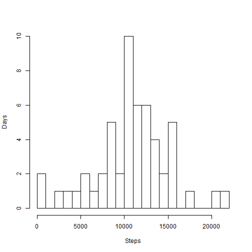
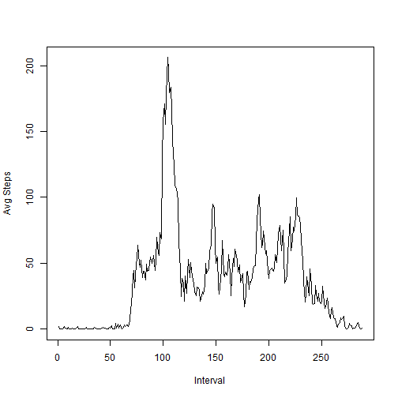
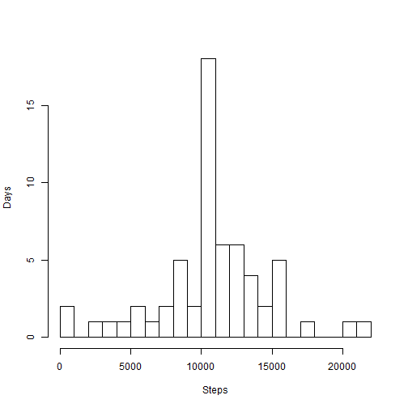
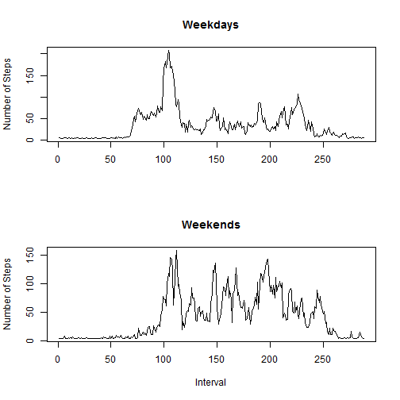

# Reproducible Research: Peer Assessment 1
## By Mike Vargas

###set defaults to show code and results

```r
library(knitr)
opts_chunk$set(echo=TRUE, results="show")
```

### Get the data
1. Download zip file
2. Unzip and read the csv file
3. Save a version without the NAs

```r
fileUrl <- "https://d396qusza40orc.cloudfront.net/repdata%2Fdata%2Factivity.zip";
fileZip <- "./activity.zip";
if (file.exists(fileZip) == F) {
  download.file(fileUrl, fileZip, mode = "wb")
}
getData <- read.csv(unz(fileZip,"activity.csv"),colClasses=c('numeric','Date','numeric'))
goodData<-na.omit(getData)
```
### Histogram of steps taken per day

```r
daySteps<-aggregate(goodData$steps, by=list(goodData$date), sum)
hist(daySteps$x, breaks=20, xlab="Steps", ylab="Days", main="")
```

 


### Mean steps per day


```r
mean(daySteps$x)
```

```
## [1] 10766
```
### Median steps per day

```r
median(daySteps$x)
```

```
## [1] 10765
```

### What is the average daily activity pattern?

```r
intSteps<-aggregate(goodData$steps, by=list(goodData$interval), mean)
plot.ts(intSteps$x, type="l", xlab="Interval", ylab="Avg Steps")
```

 


### The interval period with the most steps

```r
y<-max(intSteps$x)
z<-intSteps[intSteps['x']==y]
print(z[1])
```

```
## [1] 835
```

## Imputing missing values

###look for missing data in Steps

```r
z<-getData[is.na(getData['steps'])]
y<-length(z)
y<-y/3
dim(z)<-c(y,3)
```

### Replace missing values 
###NOTE - Strategy is to replace missing values with the average of steps per interval 

```r
meanVal<-mean(goodData$steps)
z[,1] <- replace(z[,1], is.na(z[,1]), meanVal)
colnames(z)<-colnames(goodData)
newData<-rbind(goodData,z)
newData[,1]<-as.numeric(newData[,1])
newData[,3]<-as.numeric(newData[,3])
```
### Create the new histogram

```r
daySteps<-aggregate(newData$steps, by=list(newData$date), sum)
hist(daySteps$x, breaks=20, xlab="Steps", ylab="Days", main="" )
```

 

### The new Mean

```r
mean(daySteps$x)
```

```
## [1] 10766
```


### The new Median

```r
median(daySteps$x)
```

```
## [1] 10766
```

### mark the days as weekend and weekday

```r
markDays <- function(checkDate) {

    theDate=weekdays(checkDate)
    if( theDate=="Saturday" || theDate=="Sunday") {
        return(c("weekend"))
    } else {
        return(c("weekday"))
    }  
}

b<-newData$date
d<-""
for(i in seq_along(b)) d[i]<-(markDays(b[i]))
test<-cbind(newData,d)
```

### Are there differences in activity patterns between weekdays and weekends?


```r
set1<-test[test$d=="weekday",]
set2<-test[test$d=="weekend",]

intSteps<-aggregate(set1$steps, by=list(set1$interval), mean)
intSteps2<-aggregate(set2$steps, by=list(set2$interval), mean)

par(mfrow=c(2,1)) 
plot.ts(intSteps$x, type="l",  main="Weekdays", ylab="Number of Steps", xlab="")
plot.ts(intSteps2$x, type="l",main="Weekends", xlab="Interval", ylab="Number of Steps")
```

 


